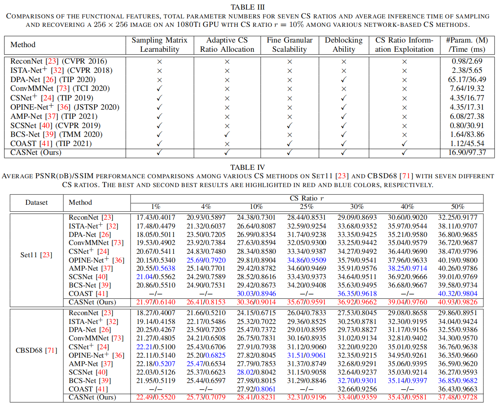

# Content-Aware Scalable Deep Compressed Sensing (TIP 2022) [PyTorch]

[](https://ieeexplore.ieee.org/document/9854112/) [](https://arxiv.org/abs/2207.09313)

[Bin Chen](https://scholar.google.com/citations?hl=en&user=aZDNm98AAAAJ) and [Jian Zhang](https://jianzhang.tech/)

*School of Electronic and Computer Engineering, Peking University Shenzhen Graduate School*

Accepted for publication as a Regular paper in the IEEE Transactions on Image Processing (T-IP).


## Abstract

To more efficiently address image compressed sensing (CS) problems, we present a novel content-aware scalable network dubbed CASNet which collectively achieves adaptive sampling rate allocation, fine granular scalability and high-quality reconstruction. We first adopt a data-driven saliency detector to evaluate the importances of different image regions and propose a saliency-based block ratio aggregation (BRA) strategy for sampling rate allocation. A unified learnable generating matrix is then developed to produce sampling matrix of any CS ratio with an ordered structure. Being equipped with the optimization-inspired recovery subnet guided by saliency information and a multi-block training scheme preventing blocking artifacts, CASNet jointly reconstructs the image blocks sampled at various sampling rates with one single model. To accelerate training convergence and improve network robustness, we propose an SVD-based initialization scheme and a random transformation enhancement (RTE) strategy, which are extensible without introducing extra parameters. All the CASNet components can be combined and learned end-to-end. We further provide a four-stage implementation for evaluation and practical deployments. Experiments demonstrate that CASNet outperforms other CS networks by a large margin, validating the collaboration and mutual supports among its components and strategies. Codes are available at [https://github.com/Guaishou74851/CASNet](https://github.com/Guaishou74851/CASNet).

## Overview

Our poster ([high-resolution PDF version](https://drive.google.com/file/d/1unkNsNGFNyknubnKFYbiXZSmLUw_Iu9D/view?usp=sharing)) in the conference of [VALSE 2022](http://valser.org/2022/#/poster):


## Environment

```shell
conda env create -f environment.yml
```

## Test

Download the model checkpoint file [net_params_320.pkl](https://drive.google.com/file/d/193UF6DoRuWYTuX_PZiR6RTIqBxyuE5e9/view?usp=sharing) and put it into `./model/layer_13_block_32`, then run:

```shell
python test.py --testset_name=Set11
python test.py --testset_name=BSD68
```

The test sets are in `./data`.

The recovered results will be in `./test_out`.

## Train

Download the preprocessed data file [Training_Data_size128_CS_T91andTrain400.mat](https://drive.google.com/file/d/18ULdi97YLqZXewoqOvdX2ci4nGCZDoku/view?usp=sharing) and put it into `./data`, then run:

```
python train.py
```

The log and model files will be in `./log` and `./model`, respectively.

## Results



## Citation

If you find the code helpful in your research or work, please cite the following paper:

```
@article{chen2022content,
  title={Content-Aware Scalable Deep Compressed Sensing},
  author={Chen, Bin and Zhang, Jian},
  journal={IEEE Transactions on Image Processing},
  volume={31},
  pages={5412--5426},
  year={2022},
  publisher={IEEE}
}
```

